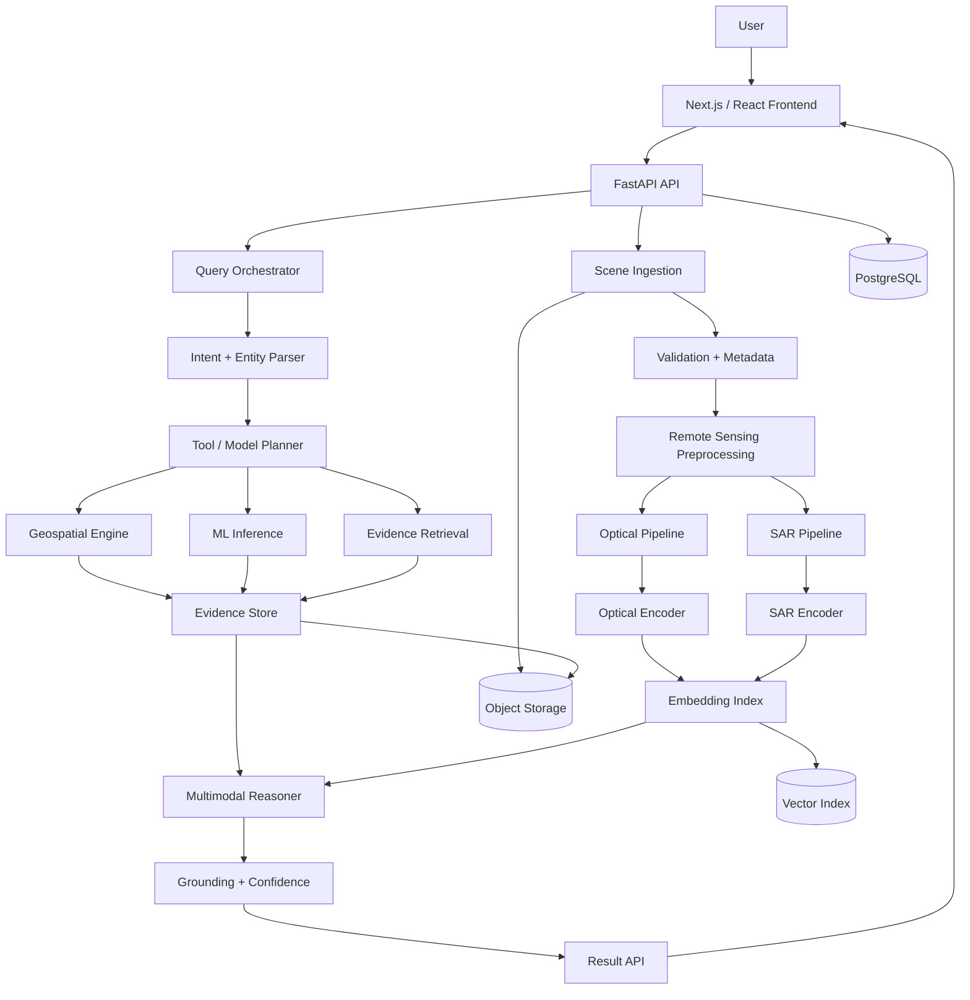
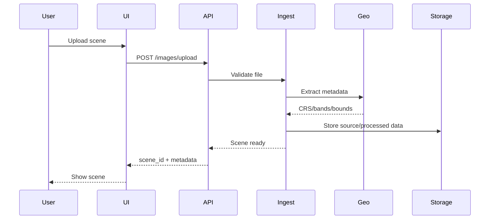
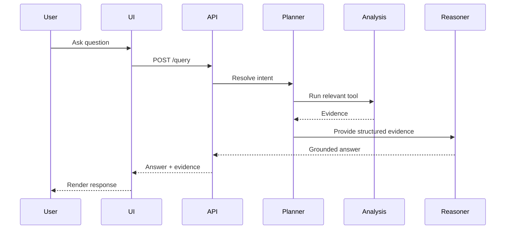
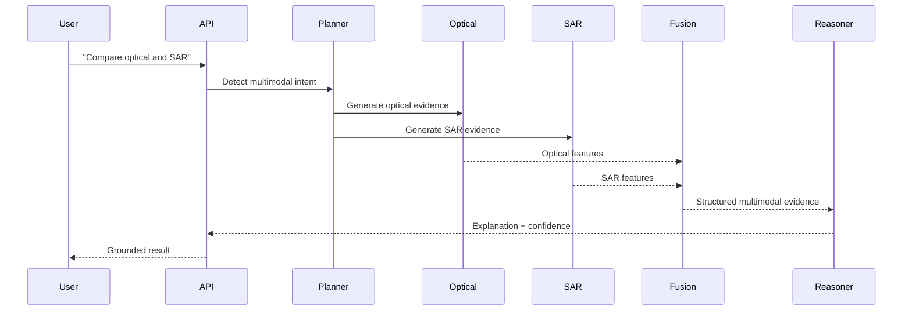
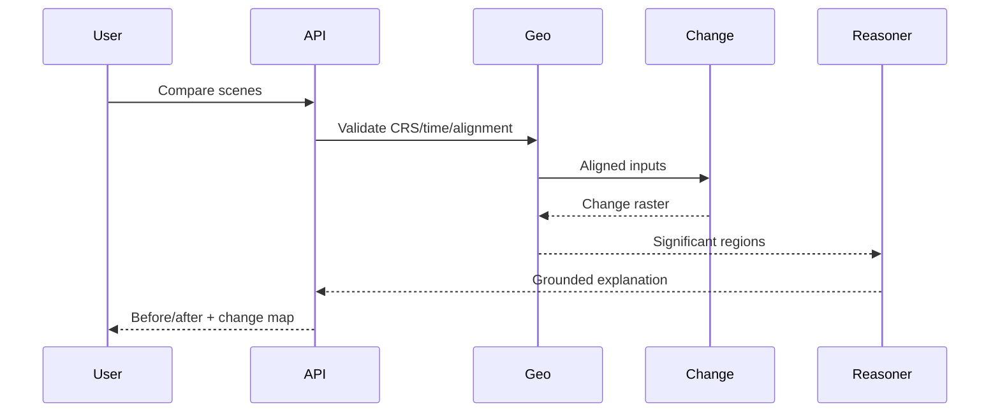
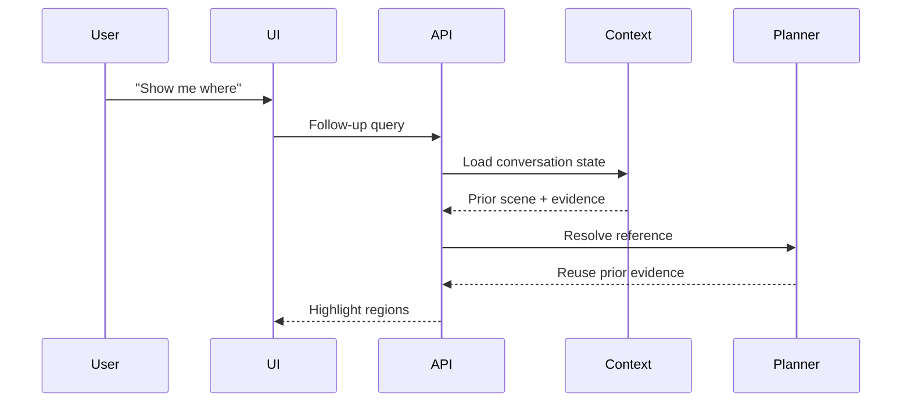

# SatQuery AI — Product Requirements Document

**Problem Statement:** SIH26167  
**Title:** SatQuery AI - An Interactive Vision-Language Assistant for Multimodal Remote Sensing Image Analysis through Text Queries  
**Organization:** Indian Space Research Organisation (ISRO)  
**Department:** Department of Space / ISRO  
**Category:** Software  
**Theme:** Space Technology  
**Document:** `PRD.md`  
**Status:** Implementation-ready hackathon PRD  
**Date:** September 2026

> **Evidence convention:**  
> **FACT** = supported by authoritative/public technical or research material.  
> **CONFIRMED REQUIREMENT** = explicitly stated in the supplied SIH problem context.  
> **ASSUMPTION** = a planning assumption that must be validated.  
> **PROPOSED DESIGN** = an engineering/product decision for the prototype.

---

# 1. Executive Summary

SatQuery AI is a multimodal geospatial intelligence assistant that lets users interrogate remote-sensing imagery using natural language.

The core product experience is:

**Select/upload satellite imagery → ask a natural-language question → obtain an evidence-grounded answer → see where the evidence occurs → ask follow-up questions.**

Unlike a generic image chatbot, SatQuery AI must preserve the physical and semantic differences between remote-sensing modalities:

- Sentinel-2 optical/multispectral imagery contains spectral information across multiple bands.
- Sentinel-1 SAR measures radar backscatter and can provide information under conditions where optical imagery is obscured by clouds or darkness.
- Geospatial metadata provides location, acquisition time, CRS, resolution, orbit/product information and other context.
- Temporal pairs enable change analysis.
- Derived indices and masks can provide explicit analytical evidence.

The product therefore combines:

1. Remote-sensing preprocessing
2. Multispectral/SAR feature extraction
3. Computer vision
4. Geospatial computation
5. Multimodal embeddings
6. Retrieval
7. Task-specific analytical tools
8. Vision-language reasoning
9. Evidence grounding
10. Interactive visualization

The system should **not** delegate scientific analysis blindly to a generic LLM. The LLM acts as a query planner/reasoning and response layer over evidence-producing tools and models.

## Product Definition

> **SatQuery AI is an evidence-grounded natural-language copilot for exploring, comparing and interpreting multimodal satellite imagery.**

The first release should optimize for a convincing, technically defensible SIH demonstration rather than attempting to become a complete commercial remote-sensing platform.

---

# 2. Problem Statement

## 2.1 Product Problem

Remote-sensing data is information-rich but difficult to interact with.

A non-specialist user may know what they want to discover:

- "Is there agricultural land here?"
- "Where is the water?"
- "What changed?"
- "Which areas have dense vegetation?"

but may not know:

- which bands to inspect,
- which indices to calculate,
- how to interpret SAR,
- how to preprocess imagery,
- how to align scenes,
- how to create masks,
- how to use GIS tools,
- which ML model is appropriate.

Traditional workflows force users through specialized software and analytical steps before they can answer simple questions.

SatQuery AI reverses the interaction:

**user intent becomes the interface**, while the system chooses appropriate computational tools.

## 2.2 Why Multimodality Matters

A satellite scene is not necessarily a photograph.

A Sentinel-2 scene may contain visible, near-infrared, red-edge and short-wave infrared measurements.

A Sentinel-1 scene contains radar observations, typically expressed through polarization/backscatter information rather than visible colors.

Therefore a product that simply converts every band into an RGB image and passes it to a generic VLM loses scientifically useful information.

## 2.3 Current Workflow

Typical analyst workflow:

```text
Find scene
  ↓
Download product
  ↓
Inspect metadata
  ↓
Open GIS/remote-sensing software
  ↓
Select bands
  ↓
Preprocess
  ↓
Calculate indices / composites
  ↓
Run model or visual inspection
  ↓
Interpret result
  ↓
Create map
  ↓
Communicate finding
```

SatQuery AI aims to reduce this to:

```text
Load scene
  ↓
Ask question
  ↓
System selects tools/data
  ↓
Evidence-producing analysis
  ↓
Grounded answer + visualization
```

---

# 3. Goals

## 3.1 MVP Goals

1. Support Sentinel-2 imagery.
2. Support a meaningful Sentinel-1 representation.
3. Preserve multi-band information internally.
4. Accept natural-language queries.
5. Provide task-aware analysis.
6. Return evidence-grounded responses.
7. Show highlighted regions when localization is possible.
8. Support basic temporal comparison.
9. Support follow-up questions within a session.
10. Expose uncertainty instead of inventing answers.
11. Provide metadata inspection.
12. Run on realistic student-team hardware/cloud GPU resources.

## 3.2 Hackathon Demo Goals

The demo should visibly prove:

- natural-language interaction,
- actual satellite-specific analysis,
- multimodal reasoning,
- spatial grounding,
- temporal reasoning,
- professional visualization,
- explainability.

## 3.3 Future Goals

- additional satellite missions,
- large-area analysis,
- streaming/near-real-time ingestion,
- automated alerts,
- agentic geospatial workflows,
- advanced temporal foundation models,
- domain-specific copilots,
- offline/on-premise deployment,
- broader sensor support.

---

# 4. Non-Goals

The MVP will **not** attempt to:

- replace professional GIS software;
- guarantee scientific conclusions;
- perform unrestricted global satellite monitoring;
- support every satellite sensor;
- train a giant foundation model from scratch;
- provide legally or operationally authoritative disaster decisions;
- claim precise object detection where resolution/evidence is insufficient;
- perform real-time planetary-scale processing;
- expose model hidden chain-of-thought;
- build enterprise Kubernetes infrastructure without a demonstrated need.

---

# 5. Target Users

| Persona | Expertise | Goals | Typical Queries | Expected Output |
|---|---|---|---|---|
| Student/researcher | Low–medium | Learn and explore imagery | "What land cover is here?" | Plain answer + visual evidence |
| GIS analyst | Medium–high | Accelerate analysis | "Show roads and water" | Layers, masks, metadata |
| Disaster analyst | Medium | Rapid assessment | "Which areas appear flooded?" | Suspected areas + confidence |
| Agricultural analyst | Medium | Identify crop/vegetation patterns | "Where is dense vegetation?" | Vegetation map + evidence |
| Urban planner | Medium | Understand development | "What changed?" | Change map |
| Environmental researcher | High | Compare environmental signals | "Where did vegetation decrease?" | Analytical layers |
| Government decision-maker | Low–medium | Obtain concise situational information | "What are the major changes?" | Summary + evidence |
| Remote-sensing expert | High | Validate AI results | "Why does the model classify this as cropland?" | Bands, indices, model evidence |

---

# 6. User Stories

1. As a user, I want to upload satellite imagery so that I can analyze my own scene.
2. As a user, I want the system to identify supported sensor/modality information automatically.
3. As a user, I want to inspect acquisition metadata before asking questions.
4. As a user, I want to ask natural-language questions instead of manually configuring GIS workflows.
5. As a user, I want to ask follow-up questions without re-uploading the scene.
6. As a user, I want to know what land-cover classes are present.
7. As a user, I want agricultural areas highlighted.
8. As a user, I want water bodies localized.
9. As a user, I want dense vegetation identified.
10. As a user, I want roads or infrastructure candidates identified where resolution permits.
11. As a user, I want to compare two scenes.
12. As a user, I want temporal change highlighted.
13. As a user, I want SAR and optical evidence compared.
14. As a user, I want the system to explain which evidence supports its conclusion.
15. As a user, I want uncertainty communicated explicitly.
16. As a user, I want the system to say when evidence is insufficient.
17. As a user, I want to view the exact region supporting an answer.
18. As a user, I want to toggle raw and derived layers.
19. As a user, I want to inspect NDVI-like vegetation evidence when applicable.
20. As a user, I want to inspect SAR backscatter/polarization evidence.
21. As a user, I want to ask "show me where" after an analytical answer.
22. As a user, I want to change visualization layers without restarting the analysis.
23. As a user, I want query history preserved during a session.
24. As a user, I want analysis results exported.
25. As a user, I want a professional-looking map suitable for presentation.
26. As a researcher, I want reproducible model/tool metadata.
27. As a researcher, I want to know which model produced an answer.
28. As an analyst, I want failed analyses to provide actionable explanations.
29. As a remote-sensing expert, I want to validate AI results against explicit evidence.
30. As a judge, I want the system to demonstrate a complete useful workflow within minutes.

---

# 7. User Journey

```text
Landing Page
    ↓
Select Demo Dataset / Upload Scene
    ↓
Validation
    ↓
Metadata Extraction
    ↓
Preprocessing
    ↓
Scene Viewer
    ↓
Natural-Language Query
    ↓
Query Intent Detection
    ↓
Evidence-Producing Tools / ML
    ↓
Multimodal Reasoning
    ↓
Grounded Answer
    ↓
Evidence Visualization
    ↓
Follow-up Question
    ↓
Optional Comparison
    ↓
Export
```

---

# 8. Core Features

## 8.1 Scene Upload — P0

**Description:** Upload supported satellite data or a prepared demonstration scene.

**Inputs:**
- GeoTIFF/COG
- supported Sentinel-derived products
- prepared multimodal scene bundle

**Processing:**
- file validation,
- metadata extraction,
- CRS detection,
- band discovery,
- nodata inspection,
- modality identification.

**Outputs:**
- scene ID,
- metadata,
- preview,
- supported analysis capabilities.

**Acceptance Criteria:**
- invalid files are rejected clearly;
- supported imagery produces a scene record;
- missing metadata is reported rather than fabricated.

## 8.2 Scene Viewer — P0

Provides:

- zoom/pan,
- layer switching,
- opacity,
- fit-to-scene,
- coordinate readout,
- metadata panel,
- evidence overlays.

## 8.3 Natural-Language Query — P0

Example:

> "Where are the areas with dense vegetation?"

The query orchestrator determines:

- intent,
- required modality,
- tools,
- spatial requirements,
- temporal requirements.

## 8.4 Evidence Grounding — P0

Every answer that can be spatially grounded should return:

- evidence type,
- geometry/mask/bounding box,
- confidence,
- supporting analytical layer.

## 8.5 Multimodal Analysis — P0/P1

Use separate processing paths for optical and SAR.

## 8.6 Change Detection — P0 for demo

Requires two aligned scenes.

Outputs:

- change score/map,
- significant regions,
- before/after visualization,
- concise explanation.

## 8.7 Follow-Up Context — P0

Conversation state should retain:

- scene IDs,
- selected regions,
- prior intent,
- analysis outputs,
- active layers.

---

# 9. Multimodal Remote-Sensing Architecture

## 9.1 Sentinel-2

Sentinel-2 is a multispectral optical Earth-observation mission.

The system should retain bands rather than collapsing everything to RGB.

Potential groups:

- visible bands,
- NIR,
- red-edge,
- SWIR.

### Engineering Requirements

1. Discover available bands from metadata.
2. Normalize bands using a documented strategy.
3. Resample only when necessary.
4. Preserve original resolution information.
5. Apply cloud/no-data masks where available.
6. Avoid treating resampled pixels as additional information.
7. Record all preprocessing operations.

### Resolution Handling

Sentinel-2 bands have different native spatial resolutions.

The MVP should choose a common analysis grid explicitly, e.g.:

```text
10 m analysis grid
```

for workflows involving 10 m bands, while recording which bands were resampled.

This is a **proposed design**, not an official SIH requirement.

## 9.2 Sentinel-1

Sentinel-1 is SAR.

SAR should not be represented internally as an ordinary RGB photograph.

Relevant information may include:

- VV,
- VH,
- polarization relationships,
- calibrated backscatter,
- texture,
- derived features.

### SAR Pipeline

```text
Input SAR product
    ↓
Validate metadata
    ↓
Calibration / product-dependent preprocessing
    ↓
Nodata handling
    ↓
Speckle strategy where appropriate
    ↓
Backscatter representation
    ↓
Polarization feature construction
    ↓
Spatial alignment
    ↓
SAR encoder / analytical tools
```

The exact preprocessing depends on the source product. The implementation must document whether it receives Level-1/Level-2 or already-preprocessed imagery.

---

# 10. Multimodal Fusion Strategy

| Strategy | Advantages | Disadvantages | Hackathon Feasibility |
|---|---|---|---|
| Early fusion | Simple tensor combination | Hard with heterogeneous modalities | Medium |
| Late fusion | Modular and robust | Less fine-grained cross-modal interaction | High |
| Intermediate fusion | Strong representation learning | More engineering | Medium |
| Cross-attention | Powerful multimodal interaction | Expensive and complex | Medium/Low |
| Separate encoders + language model | Preserves modality semantics | Requires alignment | High |
| Retrieval-based fusion | Practical and explainable | Depends on evidence quality | Very High |

## Recommended MVP

**Separate modality encoders + task tools + shared embedding/retrieval + language reasoning.**

```text
Sentinel-2 ──→ Optical Encoder ──┐
                                  ├→ Evidence/Feature Space
Sentinel-1 ──→ SAR Encoder ──────┘
                                  ↓
                         Query Orchestrator
                                  ↓
                      Retrieval + Analytical Tools
                                  ↓
                         Multimodal Reasoner
                                  ↓
                      Grounded Response
```

### Why

It avoids forcing SAR into an optical representation and lets the team use specialized tools for tasks where deterministic remote-sensing analysis is stronger than a VLM.

---

# 11. AI/ML Architecture

## 11.1 Layered Architecture

### Layer A — Deterministic Geospatial Analysis

Examples:

- reprojection,
- resampling,
- masking,
- index computation,
- raster statistics,
- alignment.

### Layer B — Task-Specific ML

Examples:

- land-cover classification,
- segmentation,
- object detection,
- change detection.

### Layer C — Multimodal Representation

Examples:

- optical embedding,
- SAR embedding,
- text embedding,
- joint embedding.

### Layer D — Retrieval

Retrieve:

- relevant scene regions,
- analytical results,
- metadata,
- similar examples,
- model outputs.

### Layer E — Language Reasoning

The language model:

- interprets intent,
- selects tools,
- combines returned evidence,
- produces a concise answer,
- communicates uncertainty.

## 11.2 Model Training Strategy

Do not train a giant model from scratch.

Preferred order:

1. Use pretrained remote-sensing encoders.
2. Freeze most parameters initially.
3. Build a task/tool layer.
4. Fine-tune lightweight adapters only if evaluation indicates a benefit.
5. Fine-tune VLM components only when sufficient task-specific data exists.

---

# 12. Candidate Models

Model selection must be validated against the exact modality, input format and license before integration.

| Model Family | Potential Role | Strength | Main Risk |
|---|---|---|---|
| CLIP-style | Image/text retrieval | Simple, proven pattern | Generic models may not understand RS semantics |
| SigLIP-style | Image/text alignment | Strong modern alignment | Sensor/domain mismatch |
| LLaVA-style | VLM reasoning | Mature architecture | RGB-oriented assumptions |
| Qwen-VL-style | General multimodal reasoning | Strong language/vision stack | Remote-sensing adaptation required |
| InternVL-style | General VLM | Strong multimodal capabilities | Compute/model compatibility |
| Prithvi-family | Earth observation representation | Domain-specific EO representation | Not a conversational assistant by itself |
| GeoCLIP-family | Geospatial representation | Geographic understanding | Not sufficient for complete VQA |
| Remote-sensing VLMs | EO language interaction | Domain alignment | Varying maturity/licensing |

## Selection Criteria

Before committing to a model, record:

- model checkpoint,
- modalities,
- input dimensions,
- band assumptions,
- pretrained domain,
- license,
- VRAM requirements,
- inference latency,
- fine-tuning method,
- benchmark evidence.

**Critical rule:** accepting image tensors is not evidence that a model understands Sentinel-1 or multispectral bands.

---

# 13. Dataset Strategy

## 13.1 BigEarthNet

BigEarthNet is an important remote-sensing benchmark family centered around Sentinel imagery and multi-label land-cover information.

For this project it can support:

- remote-sensing representation learning,
- land-cover classification,
- multimodal adaptation,
- retrieval experiments,
- pretraining/fine-tuning research.

However, **BigEarthNet alone should not be assumed to provide a complete conversational VQA training corpus.**

The team must distinguish:

- scene labels,
- captions/text annotations,
- paired modalities,
- question-answer pairs,
- pixel-level masks,
- object-level annotations.

A dataset can contain text annotations without being a conversational VQA dataset.

## 13.2 Dataset Matrix

| Dataset | Modalities | Main Task | Training | Evaluation | SatQuery Use |
|---|---|---|---|---|---|
| BigEarthNet family | Sentinel-1/Sentinel-2 depending on version | Land-cover/multimodal representation | Yes | Yes | Core adaptation |
| BigEarthNet-S2 | Sentinel-2 | Multi-label land cover | Yes | Yes | Optical classification |
| BigEarthNet-MM | Sentinel-1 + Sentinel-2 | Multimodal land cover | Yes | Yes | SAR/optical fusion |
| VRSBench | Remote-sensing imagery + language tasks | VQA/vision-language evaluation | Depends on benchmark split | Yes | VLM evaluation |
| RS VQA datasets | Varies | Question answering | Dataset-specific | Dataset-specific | Conversational task research |
| Land-cover benchmarks | Varies | Classification/segmentation | Yes | Yes | Task validation |

## 13.3 Data Leakage Prevention

- Separate train/validation/test geographically where possible.
- Avoid placing neighboring tiles from the same geographic scene across splits.
- Preserve temporal separation where relevant.
- Never evaluate on images used to construct retrieval exemplars.
- Version preprocessing.
- Version model checkpoints.
- Store dataset provenance.

---

# 14. Data Pipeline

```text
Raw Product
    ↓
File Validation
    ↓
Metadata Extraction
    ↓
CRS / Georeferencing Validation
    ↓
Band Discovery
    ↓
Cloud / NoData Handling
    ↓
Radiometric / Backscatter Preprocessing
    ↓
Spatial Alignment
    ↓
Tiling
    ↓
Derived Features
    ↓
Embeddings
    ↓
Vector / Metadata Index
    ↓
Inference
```

## 14.1 Geospatial Requirements

Every scene should preserve:

- CRS,
- affine transform,
- bounds,
- pixel size,
- dimensions,
- acquisition time,
- sensor,
- band names,
- nodata,
- source product identifier.

## 14.2 Tile Strategy

Proposed MVP:

- analysis tile around 256–512 pixels;
- overlap where needed;
- dynamic tiling for large scenes;
- retain geospatial transform for every tile.

Exact size is an engineering parameter to benchmark rather than an official requirement.

## 14.3 Recommended Libraries

- Rasterio
- GDAL
- PyProj
- Shapely
- GeoPandas
- xarray where multidimensional workflows benefit from it

---

# 15. Natural-Language Query Pipeline

Example:

> "What changed in this area?"

```text
User Query
   ↓
Intent Classification
   ↓
Entity / Temporal Requirement Extraction
   ↓
Scene Context Resolution
   ↓
Tool Selection
   ↓
Evidence Generation
   ↓
Evidence Validation
   ↓
Reasoning
   ↓
Grounded Answer
   ↓
Visualization
```

## Example: Vegetation

```text
"Where is vegetation densest?"
        ↓
Intent = vegetation analysis
        ↓
Require optical NIR + red information
        ↓
Compute appropriate vegetation feature/index
        ↓
Threshold/rank candidate regions
        ↓
Create raster mask
        ↓
Summarize
        ↓
Return highlighted regions
```

## Example: SAR

```text
"What does SAR reveal here?"
        ↓
Intent = SAR interpretation
        ↓
Select VV/VH/backscatter features
        ↓
Generate statistics/texture/features
        ↓
Retrieve relevant evidence
        ↓
Language model summarizes
```

## Example: Change

```text
"What changed between these images?"
        ↓
Intent = temporal comparison
        ↓
Validate timestamps + spatial overlap
        ↓
Co-register scenes
        ↓
Normalize/compare appropriate features
        ↓
Generate change map
        ↓
Rank significant regions
        ↓
Explain
```

---

# 16. Query Intent Taxonomy

| Intent | Required Input | Primary Tool | Visualization |
|---|---|---|---|
| Scene description | Scene | VLM + metadata | Annotated preview |
| Land-cover classification | Optical/SAR | Classifier | Class legend |
| Object detection | Appropriate resolution | Detector | Bounding boxes |
| Localization | Scene | Detector/segmenter | Mask/box |
| Counting | Suitable imagery | Detector | Instances + count |
| Comparison | 2 scenes | Comparison pipeline | Side-by-side |
| Change detection | 2 aligned scenes | Change model | Change map |
| Temporal reasoning | 2+ timestamps | Time-series pipeline | Timeline |
| Spectral reasoning | Multispectral | Index/feature tools | Index layer |
| SAR reasoning | SAR | SAR tools/model | Backscatter layer |
| Anomaly detection | Scene | Anomaly model | Heatmap |
| Disaster analysis | Suitable scenes | Task model | Suspected regions |
| Agriculture | Optical + context | Classification/index | Agriculture mask |
| Environmental | Multispectral/SAR | Analytical tools | Derived layer |

---

# 17. Grounded Answers

## 17.1 Required Output Contract

Every analytical answer should have a machine-readable structure:

```json
{
  "answer": "Several regions are consistent with dense vegetation.",
  "confidence": 0.78,
  "evidence": [
    {
      "type": "raster_region",
      "layer_id": "ndvi_01",
      "geometry": {
        "type": "Polygon",
        "coordinates": []
      },
      "reason": "High vegetation-index response"
    }
  ],
  "limitations": [
    "Cloud/no-data regions were excluded."
  ]
}
```

## 17.2 Grounding Types

- bounding box,
- polygon,
- segmentation mask,
- raster heatmap,
- point,
- evidence tile,
- before/after pair,
- spectral chart.

The UI should render the evidence corresponding to the answer.

---

# 18. Explainability

SatQuery AI should provide **evidence-based explanations**, not hidden chain-of-thought.

Good explanation:

> "The highlighted region has a strong vegetation-index response from the optical bands. The result is moderate confidence because parts of the scene contain cloud/no-data pixels."

Possible evidence:

- relevant bands,
- calculated indices,
- model confidence,
- retrieved visual examples,
- detected region,
- SAR polarization statistics,
- change magnitude.

Do not display private model chain-of-thought.

---

# 19. Hallucination Prevention

## Principles

1. Never let generated prose be the source of truth.
2. Analytical tools produce evidence.
3. The language layer summarizes evidence.
4. Unsupported claims receive low confidence.
5. Missing evidence triggers an uncertainty response.

## Example

Bad:

> "This definitely contains a highway."

Better:

> "A linear feature consistent with a road is detected in the highlighted area, with moderate confidence. The available resolution limits reliable identification of road type."

## Guardrails

- structured tool outputs,
- evidence requirement,
- confidence thresholds,
- model disagreement checks,
- retrieval verification,
- unsupported-claim detection,
- explicit "insufficient evidence" state.

---

# 20. Geospatial Engine

## MVP

Use:

- Rasterio
- GDAL
- Shapely
- PyProj
- GeoPandas where vector operations are needed.

## Optional

- PostGIS for persistent geospatial querying,
- STAC for catalog integration,
- COG for cloud-optimized raster access.

## Principle

Do not introduce PostGIS/vector databases merely because they sound enterprise-grade. For a single-machine hackathon prototype, a relational DB + object storage + lightweight vector index may be enough.

---

# 21. Frontend Product Specification

## Layout

```text
┌──────────────────────────────────────────────────────────────┐
│ SatQuery AI      Scene • Sensor • Date       Export          │
├───────────────────────────────┬──────────────────────────────┤
│                               │                              │
│       Satellite Viewer       │        AI Copilot            │
│                               │                              │
│  Layers / Evidence / Map      │  Question                   │
│                               │                              │
│                               │  Answer                     │
│                               │                              │
│                               │  Evidence                   │
│                               │                              │
├───────────────────────────────┴──────────────────────────────┤
│ Metadata • Timeline • Compare • Layer Controls                │
└──────────────────────────────────────────────────────────────┘
```

## Components

- Dashboard
- Scene picker
- Map/image viewer
- Chat panel
- Metadata drawer
- Evidence panel
- Timeline
- Comparison mode
- Layer selector
- Confidence indicator
- Query history
- Export controls.

---

# 22. UX Design

## Design Principles

### 1. Ask first

The user should not need to know which algorithm to run.

### 2. Show, don't merely tell

Every possible analytical response should have visual evidence.

### 3. Preserve expert control

Advanced users can inspect:

- bands,
- indices,
- model,
- preprocessing,
- metadata.

### 4. Explain uncertainty

Avoid false precision.

### 5. Keep the interface fast

Show staged progress:

```text
Understanding query
→ Selecting evidence
→ Running analysis
→ Verifying result
→ Rendering evidence
```

## Empty State

Example:

> "Ask SatQuery about this scene. Try: Where are the water bodies?"

## Error State

Example:

> "I couldn't perform this analysis because the uploaded scene does not contain the required bands."

---

# 23. Backend Architecture

## Services

| Service | Responsibility |
|---|---|
| API Gateway | Authentication, routing, rate limits |
| Scene Service | Upload and scene metadata |
| Preprocessing Service | Raster preparation |
| Query Orchestrator | Intent + tool planning |
| Geospatial Service | Raster/vector computation |
| ML Inference Service | Model inference |
| Embedding Service | Image/text embeddings |
| Retrieval Service | Evidence retrieval |
| Analysis Service | Change/classification/etc. |
| Result Service | Persist results |
| Object Storage | Imagery/masks/outputs |
| Database | Users/scenes/queries |
| Vector Index | Embeddings |

## Recommended Hackathon Simplification

Start with:

```text
Next.js
   ↓
FastAPI
   ↓
Python Analysis/ML modules
   ↓
PostgreSQL/SQLite
   ↓
Filesystem/MinIO
```

Split services only when scale or team ownership requires it.

---

# 24. API Specification

## POST `/images/upload`

Request:

```http
POST /images/upload
Content-Type: multipart/form-data
```

Response:

```json
{
  "scene_id": "scene_123",
  "status": "processing"
}
```

## GET `/images/{id}`

```json
{
  "id": "scene_123",
  "sensor": "sentinel-2",
  "acquisition_time": "2026-01-10T05:30:00Z",
  "crs": "EPSG:32643",
  "bounds": [],
  "bands": ["B02", "B03", "B04", "B08", "B11", "B12"]
}
```

## POST `/query`

Request:

```json
{
  "scene_id": "scene_123",
  "query": "Where is dense vegetation?"
}
```

Response:

```json
{
  "analysis_id": "analysis_456",
  "status": "completed",
  "answer": "The densest vegetation is concentrated in the highlighted regions.",
  "confidence": 0.81,
  "evidence": [
    {
      "layer_id": "vegetation_mask",
      "type": "mask"
    }
  ]
}
```

## POST `/compare`

```json
{
  "scene_a": "scene_123",
  "scene_b": "scene_456",
  "query": "What changed?"
}
```

## POST `/analyze`

```json
{
  "scene_id": "scene_123",
  "analysis_type": "water_detection",
  "parameters": {}
}
```

## GET `/results/{id}`

Returns:

- status,
- answer,
- evidence,
- layers,
- confidence,
- model metadata,
- processing time.

---

# 25. Database Design

## User

```text
id
created_at
role
```

## Scene

```text
id
user_id
sensor
product_type
acquisition_time
crs
bounds
width
height
source_uri
status
created_at
```

## Band

```text
id
scene_id
name
wavelength
resolution
path
nodata
```

## Query

```text
id
user_id
scene_id
conversation_id
text
intent
created_at
```

## Analysis

```text
id
query_id
analysis_type
model_version
status
latency_ms
confidence
```

## Evidence

```text
id
analysis_id
type
geometry
layer_uri
score
explanation
```

## Embedding

```text
id
scene_id
tile_id
modality
model
vector_reference
```

---

# 26. Storage Architecture

| Asset | Storage |
|---|---|
| Original imagery | Object storage |
| Processed imagery | Object storage |
| COGs | Object storage |
| Masks | Object storage |
| Visualization PNGs | Object storage |
| Metadata | PostgreSQL |
| Query history | PostgreSQL |
| Embeddings | Vector DB/index |
| Model artifacts | Model registry/object storage |

For the hackathon, local filesystem + SQLite/PostgreSQL + optional MinIO is acceptable.

---

# 27. System Architecture Diagram



---

# 28. Sequence Diagrams

## 28.1 Image Upload



## 28.2 Simple Question



## 28.3 Multimodal Question



## 28.4 Change Detection



## 28.5 Follow-Up



---

# 29. MVP Definition

## MUST HAVE — P0

1. Sentinel-2 scene ingestion.
2. Prepared Sentinel-1 representation.
3. Metadata extraction.
4. Natural-language query interface.
5. Land-cover/scene understanding.
6. Vegetation analysis.
7. Water detection.
8. Grounded visual evidence.
9. Basic change detection with two scenes.
10. Follow-up queries.
11. Professional scene viewer.
12. Confidence/uncertainty.
13. Exportable result.

## SHOULD HAVE — P1

- SAR/optical comparison.
- object detection.
- evidence tiles.
- query history.
- timeline.
- advanced metadata.
- lightweight retrieval.

## NICE TO HAVE — P2

- multi-scene temporal analytics,
- automatic STAC search,
- anomaly detection,
- advanced segmentation,
- more satellites.

## DO NOT BUILD DURING HACKATHON

- global real-time monitoring,
- custom giant foundation model,
- Kubernetes cluster,
- fully autonomous geospatial agent,
- production-scale multi-tenant platform,
- every satellite sensor,
- unrestricted object recognition.

---

# 30. Hackathon Demo Flow

Target duration: **3–5 minutes**.

## Scene 1 — Establish the Problem

Load a satellite scene.

Say:

> "Instead of manually choosing bands and GIS tools, we're going to ask the satellite a question."

## Scene 2 — Natural Language

Ask:

> "What land-cover types are visible here?"

Show:

- answer,
- classes,
- highlighted evidence.

## Scene 3 — Vegetation

Ask:

> "Where is the densest vegetation?"

Show:

- vegetation layer,
- highlighted regions,
- evidence explanation.

## Scene 4 — Water

Ask:

> "Show me the water bodies."

Show mask/regions.

## Scene 5 — Temporal Reasoning

Load a second scene.

Ask:

> "What changed between these two images?"

Show:

- before/after,
- change map,
- significant regions.

## Scene 6 — Multimodal

Switch to SAR.

Ask:

> "What does SAR reveal that the optical image does not?"

Show:

- SAR layer,
- VV/VH or derived evidence,
- concise interpretation.

## Scene 7 — Follow-Up

Ask:

> "Show me where you found that."

Highlight evidence.

## Scene 8 — Close

Export a map/report.

### Demo Story

```text
Observe
→ Understand
→ Localize
→ Compare
→ Explain
→ Ground
```

---

# 31. Killer Features

| Feature | Impact | Feasibility | Novelty | Demo Value |
|---|---:|---:|---:|---:|
| Natural-language geospatial analysis | 5 | 5 | 4 | 5 |
| SAR + optical reasoning | 5 | 4 | 5 | 5 |
| "Show me where" grounding | 5 | 5 | 5 | 5 |
| Evidence-backed answers | 5 | 5 | 5 | 5 |
| Temporal reasoning | 5 | 4 | 4 | 5 |
| Spectral reasoning | 4 | 5 | 4 | 4 |
| Analyst copilot | 5 | 4 | 4 | 5 |
| Automatic modality selection | 4 | 4 | 5 | 4 |
| Interactive follow-up | 4 | 5 | 4 | 5 |

## Top Differentiator

**Evidence-grounded natural-language reasoning over heterogeneous remote-sensing modalities.**

The product should demonstrate:

> "Ask the satellite" is not merely a chatbot metaphor — the answer is connected to actual geospatial evidence.

---

# 32. Competitive Analysis

| Capability | Generic Vision Chatbot | Traditional GIS | RS Classifier | Satellite Platform | SatQuery AI |
|---|---|---|---|---|---|
| Natural language | High | Low | Low | Medium | High |
| Multispectral semantics | Low/uncertain | High | High | High | High |
| SAR awareness | Low | High | Varies | High | High |
| Grounded regions | Limited | High | High | High | High |
| Follow-up dialogue | High | Low | Low | Medium | High |
| Evidence explanation | Medium | Manual | Medium | Medium | High |
| Temporal reasoning | Low | High/manual | Medium | High | High |
| Non-expert usability | High | Low | Medium | Medium | High |

## Actual Differentiator

Not "AI + satellite images."

It is:

**natural-language orchestration of remote-sensing-specific analytical tools, multimodal models and geospatial evidence.**

---

# 33. Technical Risks

| Risk | Probability | Impact | Mitigation | Fallback |
|---|---|---|---|---|
| Hallucination | High | High | Evidence-first generation | Refuse unsupported claim |
| Insufficient VQA data | High | High | Tool-based evidence + retrieval | Narrow task scope |
| SAR misinterpretation | Medium | High | Dedicated SAR pipeline | Restrict claims |
| GPU limits | High | High | Quantization/frozen models | CPU/deterministic tools |
| Large imagery | High | Medium | Tiling/COG | Size limits |
| Cloud cover | Medium | Medium | Masks | Explain limitation |
| Alignment errors | Medium | High | CRS/grid checks | Reject comparison |
| License incompatibility | Medium | High | License audit | Replace model |
| Slow inference | High | Medium | Caching | Smaller model |
| Benchmark mismatch | High | Medium | Task-specific evaluation | Human evaluation |
| Model availability | Medium | High | Modular model gateway | Backup model |
| Bad metadata | Medium | Medium | Validation | Manual metadata entry |

---

# 34. Performance Requirements

These are **proposed engineering targets**, not official ISRO requirements.

| Metric | MVP Target |
|---|---:|
| Small image upload acknowledgement | < 3 s |
| Metadata extraction | < 5 s |
| Typical analytical query | 5–20 s |
| Cached query | < 3 s |
| UI interaction latency | < 200 ms |
| Demo concurrent users | 1–5 |
| Suggested max upload | 1–2 GB |
| Typical inference tile | 256–512 px |
| GPU | 16–24 GB preferred |
| RAM | 32 GB preferred |
| Local storage | 100+ GB recommended |

The architecture should degrade gracefully on weaker hardware.

---

# 35. Evaluation Framework

## 35.1 Classification

- accuracy,
- macro F1,
- per-class F1,
- multi-label F1 where applicable.

## 35.2 Retrieval

- Recall@K,
- Precision@K,
- MRR where relevant.

## 35.3 Localization

- IoU,
- point/box localization accuracy.

## 35.4 Segmentation

- IoU,
- Dice/F1.

## 35.5 Change Detection

- precision,
- recall,
- F1,
- IoU,
- false-positive rate.

## 35.6 VQA

- exact/semantic answer accuracy,
- expert-rated correctness,
- grounded-answer accuracy.

## 35.7 Hallucination

Measure:

```text
unsupported claims / total factual claims
```

Use a manually annotated evaluation set for the prototype.

## 35.8 Human Evaluation

Experts rate:

- correctness,
- usefulness,
- clarity,
- evidence quality,
- uncertainty calibration.

---

# 36. Benchmark Strategy

## BigEarthNet

Use for remote-sensing representation/classification evaluation where applicable.

Do not claim it directly measures conversational VQA unless the specific benchmark subset/task actually does.

## VRSBench

Use only for the tasks it explicitly evaluates.

The benchmark should be mapped to:

- image-text understanding,
- question answering,
- grounding,
- retrieval,

according to its documented task definitions.

## Internal SatQuery Benchmark

Create a small expert-curated benchmark:

```text
100–500 queries
+
known scenes
+
expected evidence
+
expected answer constraints
```

Categories:

- scene description,
- land cover,
- water,
- vegetation,
- SAR,
- comparison,
- change,
- localization,
- uncertainty.

---

# 37. Security & Privacy

## Requirements

- authentication,
- authorization,
- file type validation,
- upload size limits,
- path traversal protection,
- malicious file handling,
- API rate limiting,
- secret management,
- model endpoint isolation,
- per-user scene access control.

## Data Isolation

Users should never be able to request another user's scene by guessing an ID.

Use opaque IDs and authorization checks.

## File Security

- MIME/content validation,
- decompression safeguards,
- no arbitrary code execution,
- sandbox model/file processing where appropriate.

---

# 38. Deployment Architecture

## Hackathon

Preferred:

```text
Browser
  ↓
Next.js
  ↓
FastAPI
  ↓
Single Python application
  ├── Geo processing
  ├── ML inference
  └── Query orchestration
  ↓
PostgreSQL/SQLite
  ↓
Local object storage
```

One GPU workstation is sufficient for the prototype if models are appropriately selected.

## Small Deployment

```text
Reverse Proxy
   ↓
Frontend
   ↓
API
   ↓
GPU inference service
   ↓
PostgreSQL + Object Storage
```

## Kubernetes

Only introduce Kubernetes if there is an actual scaling/operations requirement.

For the SIH prototype it is likely unnecessary.

---

# 39. Recommended Tech Stack

## Frontend

### Next.js + React + TypeScript

Why:

- rapid development,
- strong component ecosystem,
- easy deployment,
- good support for interactive dashboards.

### Tailwind CSS

For rapid consistent UI construction.

### MapLibre GL JS

Preferred when interactive geospatial maps are required without proprietary map infrastructure.

Leaflet/OpenLayers are acceptable alternatives depending on raster/map rendering requirements.

## Backend

### Python + FastAPI

Why:

- excellent ML ecosystem,
- async API support,
- automatic OpenAPI documentation,
- easy integration with geospatial libraries.

## ML

- PyTorch
- Hugging Face Transformers
- PEFT where adapter fine-tuning is justified.

## Geospatial

- GDAL
- Rasterio
- Shapely
- PyProj
- GeoPandas
- xarray where useful.

## Database

- PostgreSQL
- PostGIS only when persistent spatial queries justify it.

## Object Storage

- MinIO for local/S3-compatible development,
- S3-compatible production storage if needed.

## Vector Search

Start with FAISS or pgvector.

Do not add a dedicated vector database unless scale requires it.

## Deployment

- Docker
- Docker Compose for hackathon integration.

---

# 40. Repository Structure

```text
satquery-ai/
├── README.md
├── PRD.md
├── LICENSE
├── .env.example
├── docker-compose.yml
│
├── frontend/
│   ├── app/
│   ├── components/
│   ├── features/
│   │   ├── viewer/
│   │   ├── chat/
│   │   ├── comparison/
│   │   └── evidence/
│   ├── lib/
│   ├── hooks/
│   ├── types/
│   └── tests/
│
├── backend/
│   ├── app/
│   │   ├── main.py
│   │   ├── api/
│   │   ├── models/
│   │   ├── schemas/
│   │   ├── services/
│   │   ├── orchestration/
│   │   └── core/
│   └── tests/
│
├── ml/
│   ├── encoders/
│   ├── models/
│   ├── inference/
│   ├── retrieval/
│   ├── training/
│   ├── evaluation/
│   └── configs/
│
├── geospatial/
│   ├── preprocessing/
│   ├── raster/
│   ├── vector/
│   ├── sar/
│   ├── optical/
│   ├── indices/
│   └── change_detection/
│
├── data/
│   ├── raw/
│   ├── processed/
│   ├── manifests/
│   └── samples/
│
├── models/
│   ├── checkpoints/
│   └── configs/
│
├── infrastructure/
│   ├── docker/
│   ├── monitoring/
│   └── deployment/
│
├── scripts/
│   ├── download_data.py
│   ├── preprocess.py
│   ├── build_index.py
│   └── evaluate.py
│
├── tests/
│   ├── integration/
│   ├── e2e/
│   └── fixtures/
│
└── docs/
    ├── architecture.md
    ├── model-card.md
    ├── dataset-card.md
    └── demo-script.md
```

---

# 41. Development Phases

## Phase 0 — Research

Tasks:

- validate SIH requirements,
- inspect datasets,
- benchmark candidate models,
- audit licenses,
- define demo scenarios.

Output:

- model decision,
- dataset decision,
- architecture decision record.

Completion:

- team can explain why each core model/tool exists.

## Phase 1 — Prototype

Tasks:

- viewer,
- sample scene,
- basic query endpoint,
- static evidence.

Output:

- clickable vertical slice.

## Phase 2 — Ingestion

Tasks:

- upload,
- metadata,
- raster validation,
- preprocessing.

Output:

- real scene loaded into viewer.

## Phase 3 — AI Pipeline

Tasks:

- encoder,
- classifier,
- retrieval,
- language layer.

Output:

- useful answers.

## Phase 4 — Grounding

Tasks:

- masks,
- boxes,
- evidence tiles,
- confidence.

Output:

- evidence-backed responses.

## Phase 5 — UI

Tasks:

- polished viewer,
- chat,
- comparison,
- evidence panel.

## Phase 6 — Integration

Tasks:

- end-to-end workflow,
- failure handling,
- caching.

## Phase 7 — Evaluation

Tasks:

- benchmark suite,
- latency,
- hallucination tests,
- human evaluation.

## Phase 8 — Demo Polishing

Tasks:

- seed data,
- scripted queries,
- visual polish,
- fallback mode,
- offline demo reliability.

---

# 42. Team Task Allocation

## 4-Person Team

### Member 1 — Frontend/UX

- viewer,
- chat,
- evidence,
- comparison,
- demo UX.

### Member 2 — Backend/Systems

- FastAPI,
- database,
- APIs,
- orchestration,
- storage.

### Member 3 — AI/ML

- model selection,
- inference,
- retrieval,
- VLM,
- evaluation.

### Member 4 — Geospatial/Remote Sensing

- preprocessing,
- Sentinel-1/2 handling,
- indices,
- change detection,
- GIS evidence.

## 5–6 Person Team

Add:

### ML Research

- fine-tuning,
- benchmarks,
- model experiments.

### DevOps/Presentation

- Docker,
- deployment,
- monitoring,
- demo reliability,
- documentation/pitch.

---

# 43. Acceptance Criteria

## AC-01 Upload

**Given** a supported satellite scene  
**When** the user uploads it  
**Then** the system creates a scene and extracts metadata.

## AC-02 Invalid File

**Given** an unsupported/corrupt file  
**When** uploaded  
**Then** the system rejects it with a clear message.

## AC-03 Metadata

**Given** a valid scene  
**When** the metadata panel is opened  
**Then** sensor, acquisition information, CRS and available bands are displayed when present.

## AC-04 Query

**Given** a loaded scene  
**When** the user asks a supported question  
**Then** the system returns a response or explicit inability state.

## AC-05 Vegetation

**Given** required optical bands  
**When** the user asks about vegetation  
**Then** the system produces vegetation evidence and highlights relevant regions.

## AC-06 Water

**Given** suitable optical imagery  
**When** the user asks where water is present  
**Then** water candidate regions are visualized.

## AC-07 Grounding

**Given** a spatially answerable query  
**When** the analysis completes  
**Then** at least one evidence geometry/layer is returned where available.

## AC-08 Confidence

**Given** an ML-derived answer  
**When** the response is rendered  
**Then** confidence/uncertainty is shown.

## AC-09 Insufficient Evidence

**Given** missing required data  
**When** the user requests an unsupported analysis  
**Then** the system explains the limitation.

## AC-10 Follow-Up

**Given** an existing analysis  
**When** the user asks "show me where"  
**Then** the system resolves the reference and highlights prior evidence.

## AC-11 Comparison

**Given** two compatible scenes  
**When** the user requests comparison  
**Then** the system validates alignment before analysis.

## AC-12 Misalignment

**Given** scenes with incompatible spatial references  
**When** comparison is requested  
**Then** the system either aligns them safely or reports inability.

## AC-13 Change Detection

**Given** aligned scenes at different times  
**When** change detection is requested  
**Then** a change visualization is produced.

## AC-14 SAR

**Given** supported SAR inputs  
**When** a SAR-specific query is requested  
**Then** the system uses SAR features rather than pretending the input is RGB.

## AC-15 Optical/SAR Comparison

**Given** aligned optical and SAR observations  
**When** comparison is requested  
**Then** the response identifies evidence from both modalities.

## AC-16 Export

**Given** completed analysis  
**When** export is selected  
**Then** the system produces a result package/map.

## AC-17 Query History

**Given** multiple questions  
**When** the session is reopened  
**Then** query history remains available if persistence is enabled.

## AC-18 Loading State

**Given** long-running analysis  
**When** inference is active  
**Then** progress state is displayed.

## AC-19 Model Failure

**Given** inference service failure  
**When** a query is submitted  
**Then** the system returns an actionable error/fallback.

## AC-20 GPU Failure

**Given** GPU unavailable  
**When** a lightweight supported query is requested  
**Then** deterministic CPU analysis may still operate.

## AC-21 Large File

**Given** an oversized upload  
**When** submitted  
**Then** the system rejects or requests a supported representation.

## AC-22 Cloud Cover

**Given** heavy cloud/no-data areas  
**When** optical analysis is requested  
**Then** affected areas are excluded or flagged.

## AC-23 Evidence Consistency

**Given** a generated answer  
**When** evidence is inspected  
**Then** the evidence must correspond to the same scene and analysis run.

## AC-24 Provenance

**Given** a result  
**When** the user opens details  
**Then** model/tool/preprocessing versions are available.

## AC-25 Security

**Given** a user requests a scene  
**When** they are unauthorized  
**Then** access is denied.

## AC-26 Session Context

**Given** a prior query selected a region  
**When** the next query references "that region"  
**Then** the system retains the reference where unambiguous.

## AC-27 Unsupported Sensor

**Given** an unsupported sensor  
**When** uploaded  
**Then** the UI explains supported alternatives.

## AC-28 Empty Evidence

**Given** no relevant evidence is detected  
**When** analysis completes  
**Then** the system reports no reliable detection rather than inventing one.

## AC-29 Latency

**Given** a normal demo scene  
**When** a cached/lightweight query runs  
**Then** it should meet the proposed latency target where hardware permits.

## AC-30 Reproducibility

**Given** the same scene, preprocessing configuration and model version  
**When** the same deterministic analysis is rerun  
**Then** results should be reproducible within defined numerical tolerances.

---

# 44. Example Queries

## Basic

1. What is visible in this scene?
2. What land-cover types are present?
3. Is there agricultural land?
4. Where is the water?
5. Which areas are vegetated?
6. What are the most prominent features?
7. Are there settlements?
8. Are there roads?
9. What is unusual about this image?
10. Give me a summary of this scene.

## Intermediate

11. Where is vegetation densest?
12. Show the agricultural regions.
13. Highlight water bodies.
14. Where are the largest built-up areas?
15. What evidence suggests cropland?
16. Which regions have low vegetation?
17. Identify major linear infrastructure.
18. Count visible candidate buildings if resolution permits.
19. Show areas with high vegetation-index response.
20. What regions should I inspect manually?

## Advanced

21. What changed between these images?
22. Where did vegetation decrease?
23. Where did built-up land increase?
24. Which regions show unusual change?
25. Explain the evidence for the agricultural classification.
26. Compare the northern and southern regions.
27. What features are most uncertain?
28. What areas deserve analyst review?
29. Which findings are strongly supported?
30. Which findings are weakly supported?

## Multimodal

31. Compare optical and SAR observations.
32. What does SAR reveal here?
33. Which features are visible in SAR but less clear optically?
34. Does the SAR response support the optical interpretation?
35. Explain the VV/VH evidence.
36. Are there regions with unusual backscatter?
37. Compare vegetation-related evidence across modalities.
38. Which modality is more informative for this question?

## Temporal

39. What changed over time?
40. Where did water appear?
41. Where did vegetation change?
42. Where did urban development increase?
43. Which regions remained stable?
44. Show the largest changes.
45. Explain the most significant change.

## Disaster

46. Which areas appear potentially flooded?
47. Where are the strongest anomalous regions?
48. What evidence supports possible inundation?
49. Compare pre-event and post-event imagery.
50. Which areas require human verification?

---

# 45. Example AI Responses

## Good: Vegetation

> **Answer:** Dense vegetation is concentrated in the highlighted regions.  
> **Confidence:** High  
> **Evidence:** The optical analysis shows a strong vegetation-index response in these areas.  
> **Caution:** Cloud/no-data pixels were excluded, and the result is not a species or crop-type identification.

## Good: Road

> **Answer:** A linear feature consistent with a road is visible in the highlighted region.  
> **Confidence:** Moderate  
> **Evidence:** The feature has a road-like spatial pattern.  
> **Caution:** The available resolution is insufficient to reliably determine road class or condition.

## Good: Change

> **Answer:** The largest detected change occurs in the highlighted eastern region.  
> **Confidence:** Moderate–high  
> **Evidence:** The corresponding pixels show a substantial difference between the two aligned observations.  
> **Caution:** Change detection identifies spectral/backscatter differences; it does not automatically establish the human cause.

## Good: Insufficient Evidence

> **Answer:** I cannot reliably determine whether this is a specific crop type from the available imagery.  
> **Why:** The available bands and spatial resolution support broader vegetation/agricultural analysis, but not confident crop-species identification.

---

# 46. Failure Scenarios

## Corrupted Image

Return:

> "The file could not be decoded as a supported raster product."

## Unsupported Sensor

Return:

> "This sensor is not currently supported. SatQuery can analyze the configured Sentinel-1/Sentinel-2 workflows."

## Missing Metadata

Do not invent:

- CRS,
- acquisition date,
- sensor,
- resolution.

Ask for metadata or mark fields unknown.

## Cloud-Covered Optical Scene

Inform the user:

> "Large portions of the optical scene are affected by cloud/no-data conditions. Results are restricted to usable pixels."

## Impossible Query

Example:

> "What will this location look like next year?"

Return that predictive forecasting is not supported by the current MVP.

## Low Confidence

Do not force a categorical answer.

## Model Unavailable

Fallback to deterministic tools where possible.

## GPU Unavailable

Use lightweight CPU workflows or provide a controlled fallback.

## Image Too Large

Offer:

- resize,
- COG conversion,
- tiling,
- smaller region of interest.

## Modalities Don't Align

Do not perform pixel-level comparison without validation.

---

# 47. Observability

## Application Metrics

- request count,
- error rate,
- query completion rate,
- p50/p95 latency,
- upload failures.

## ML Metrics

- inference latency,
- GPU memory,
- GPU utilization,
- model errors,
- confidence distribution.

## Product Metrics

- queries/session,
- follow-up rate,
- successful evidence generation,
- export rate,
- unsupported-query rate.

## Quality Monitoring

Track:

```text
queries
→ tool selected
→ evidence produced
→ answer generated
→ answer grounded?
→ user correction?
```

User corrections are especially valuable for future evaluation.

---

# 48. Cost Analysis

All costs are approximate engineering planning estimates and depend heavily on model selection and cloud provider.

## Hackathon Prototype

Potential resources:

- existing student laptops,
- one GPU workstation or rented GPU,
- local storage,
- open-source models,
- open-source geospatial libraries.

Target:

**near-zero to low hundreds of USD equivalent** if using mostly local/open-source infrastructure.

## Small Deployment

Potential costs:

- one GPU inference instance,
- managed database,
- object storage,
- bandwidth,
- monitoring.

Expected cost depends strongly on inference volume.

## Production Scale

Would require:

- autoscaling GPU inference,
- object storage,
- CDN/tile serving,
- database scaling,
- observability,
- model serving infrastructure.

Do not optimize for this during SIH.

---

# 49. Future Roadmap

## Phase 2

- more satellite missions,
- more SAR products,
- richer temporal reasoning,
- large-area analysis,
- STAC-native search,
- automated alerts.

## Phase 3

- agentic geospatial workflows,
- user-defined analytical recipes,
- advanced temporal foundation models,
- domain copilots.

## Phase 4

- on-premise government deployment,
- secure air-gapped operation,
- large-scale distributed processing,
- analyst collaboration.

---

# 50. Final Product Definition

> **SatQuery AI is an evidence-grounded multimodal geospatial intelligence assistant that lets users explore, compare and interpret remote-sensing imagery through natural-language questions.**

Its defining capability is not simply image captioning.

The system connects:

```text
Natural Language
      +
Remote-Sensing-Specific AI
      +
Multispectral/SAR Processing
      +
Geospatial Computation
      +
Retrieval
      +
Grounded Visualization
      +
Uncertainty
```

into one interaction loop.

The winning product experience is:

> **Ask a question → SatQuery selects the appropriate remote-sensing evidence → performs the analysis → explains the result → shows exactly where the evidence came from → lets the user ask the next question.**

---

# Appendix A — Architecture Decision Principles

1. Evidence before prose.
2. Separate optical and SAR semantics.
3. Prefer pretrained models.
4. Keep deterministic analytical tools in the loop.
5. Make every AI claim measurable.
6. Reject unsupported scientific claims.
7. Optimize for a reliable vertical slice.
8. Avoid unnecessary infrastructure.
9. Preserve geospatial provenance.
10. Design the demo around visible evidence.

---

# Appendix B — Suggested MVP Tool Registry

```text
scene.describe
landcover.classify
vegetation.analyze
water.detect
object.detect
change.detect
sar.describe
optical.describe
modalities.compare
region.highlight
metadata.inspect
evidence.explain
```

Each tool should return structured JSON rather than free-form prose.

Example:

```json
{
  "tool": "vegetation.analyze",
  "scene_id": "scene_123",
  "status": "success",
  "outputs": {
    "mask_uri": "object://...",
    "statistics": {
      "mean": 0.42,
      "max": 0.91
    }
  },
  "confidence": 0.84,
  "limitations": [
    "Cloud-masked pixels excluded"
  ]
}
```

---

# Appendix C — Model Gateway Contract

```json
{
  "model_id": "model_name",
  "version": "1.0",
  "input": {
    "scene_id": "scene_123",
    "modalities": ["sentinel-2"]
  },
  "task": "landcover",
  "output": {
    "predictions": [],
    "confidence": 0.0,
    "evidence": []
  }
}
```

The model gateway must make model replacement possible without rewriting the frontend.

---

# Appendix D — Definition of Done

The SIH MVP is complete when:

- [ ] A real remote-sensing scene can be loaded.
- [ ] Metadata is displayed.
- [ ] Sentinel-2 bands are preserved internally.
- [ ] Sentinel-1 data is handled through a distinct SAR pipeline.
- [ ] A user can ask natural-language questions.
- [ ] At least 3–5 meaningful analytical tasks work.
- [ ] Answers are grounded spatially where possible.
- [ ] At least one temporal comparison works.
- [ ] At least one SAR + optical demonstration works.
- [ ] Follow-up questions work.
- [ ] Uncertainty is visible.
- [ ] Unsupported questions fail safely.
- [ ] Results can be exported.
- [ ] End-to-end demo works on the team's target hardware.
- [ ] Evaluation results are documented.
- [ ] Model/data licenses are documented.
- [ ] No core feature depends on an unavailable proprietary service.

---

# Appendix E — Research/Reference Targets

The implementation team should maintain a `docs/references.md` containing the exact versions/URLs consulted for:

1. Official SIH26167 problem statement.
2. ISRO Earth-observation resources.
3. ESA/Copernicus Sentinel-1 documentation.
4. ESA/Copernicus Sentinel-2 documentation.
5. BigEarthNet official resources.
6. BigEarthNet-MM/S1/S2 documentation.
7. VRSBench documentation/paper.
8. Remote-sensing VQA papers.
9. Remote-sensing foundation model papers.
10. Candidate model cards.
11. Candidate dataset cards.
12. GDAL/Rasterio documentation.
13. STAC/COG specifications where adopted.

For every model and dataset, record:

```text
Name
Version
URL
License
Modality
Input assumptions
Task
Benchmark evidence
Hardware requirement
SatQuery role
```

This reference register is part of the engineering deliverable and must be kept current as model/dataset decisions change.
